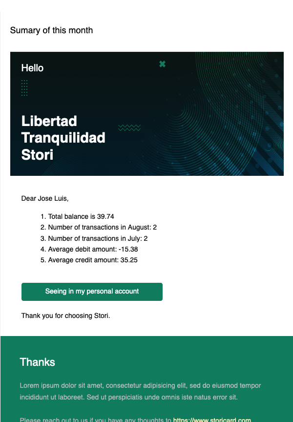

# Stori Project Challenge

<p align="center">
  <a href="">
    
  </a>
</p>

<h1 align="center">
   Golang
</h1>


<p align="center">
 Example of a <strong>Golang application using Dynamo(AWS)</strong>
to handler the data and getting  a summary about the debit and credit average.
</p>


## 🚀 Environment Setup

### 🐳 Needed tools

1. [Install Docker](https://www.docker.com/get-started)
2. [Install docker-compose](https://www.docker.com/get-started)
3. Clone this project: `git clone git@github.com:joseluiszuflores/stori-challenge.git`
4. Move to the project folder: `cd stori`
5. [Install mock](https://github.com/golang/mock)
6. [Install golang-ci](https://github.com/golangci/golangci-lint)
7. go install github.com/jstemmer/go-junit-report@latest
8. [amazon/dynamodb-local](https://hub.docker.com/r/amazon/dynamodb-local/)

|                       | Description                                                                                                                                              |
|-----------------------|----------------------------------------------------------------------------------------------------------------------------------------------------------|
| Docker                | docker is used to contain our application and if it will necessary to  deploy it to another platform, such as kubernetes                                 |
| docker-compose        | docker-compose is the tools that help us to manage our container avoiding  run one by one we can running all containers with DB                          |
| mock                  | Mock is the tools that help us with some test, for example if we have to do test to some struct that use the DB access, we can mock this with this tool. |
| golang-ci             | golang ci has the best practices at the moment to develop new projects we just add to our IDE or we can execute  in our terminals                        |
| amazon/dynamodb-local | dynamodb-local helps us interact with dynamodb AWS locally                                                                                               |

### 🛠️ Environment configuration

1. Create a local environment file (`stori.env`) if you want to change any parameter, and you should add this to docker-compose or in your  platform


| ENV                      | Description                                                                                                                              |
|--------------------------|------------------------------------------------------------------------------------------------------------------------------------------|
| SMTP_HOST                | Is the host define by your SMTP provider for gmail is smtp.gmail.com                                                                     |
| SMTP_PORT                | Is the port define by your SMTP provider for gmail is 587                                                                                |
| SMTP_USERNAME            | The user may  is  your user email                                                                                                        |
| SMTP_PASSWORD            | The password of your email                                                                                                               |
| SMTP_TEMPLATE_PATH_EMAIL | We are using a template that we replace some values that golang allows and this will sent by our service of Email                        |
| AWS_ACCESS_KEY           | Specifies an AWS access key associated with an IAM user or role.The access key aws_access_key_id is required to connect to Amazon Dynamo |
| AWS_SECRET_ACCESS_KEY    | Specifies the secret key associated with the access key. This is essentially the "password" for the access key.                          |
| AWS_REGION               | Region where we have the dynamo available                                                                                                |
| DEV_ENV                  | Help us to develop our features in production it will be modified to false                                                               |
| AWS_URL_DYNAMO_DEV       | To mock our service like dynamo we should add our URL where dynamo running                                                               |

> In case of SMTP vars we should change it if we will decide use another service.

### 🔥 Application execution

#### Install dependencies
1.  [Install mock](https://github.com/golang/mock) with  ` go install github.com/golang/mock/mockgen@v1.6.0`
2. Install all the dependencies  `go mod tidy`

#### Use
This system is a script that needs  two flags

1. path: path where our script found the  csv file
2. user: id of the user where we extract the information like name and email it should be an int value 

If we run the script without these flags we will get:

``` bash
$ ./main evaluate
The flag path is empty. Please consider add the path of file csv
``` 
or 
``` bash
$ ./main evaluate --path=./example.csv
The flag user is necessary to sent the email correctly
```

To get the correct output we should add these flags, and we will see something like this
``` bash
$./main evaluate --path="/Users/josezuniga/Code/stori/example.csv" --user=1

Success sending the email with the information
```
>  For the correct running we should already  have a user with information such as  email and name 

We already have our email with information  like this.

 

#### Errors Generals


| Error                                                                                                  | Description                                                                                                           |
|--------------------------------------------------------------------------------------------------------|-----------------------------------------------------------------------------------------------------------------------|
| error sending the email [gomail: could not send email 1: gomail: invalid address "": mail: no address] | The user doesn't have an email or doesn't exist this user                                                             |
| error migrating: [error to create client/transactions table]                                           | Please check the configuration env `AWS_URL_DYNAMO_DEV` usually this error is related with our DynamoDB's credentials |

This is the struct of this project
``` bash
 ~/c/stori tree -L 4
.
├── Dockerfile
├── README.md
├── cmd
│   ├── bootstrap
│   │   └── boostrap.go // we declared and instanced our structs here
│   └── main.go
├── docker-compose.yml // For local use only..
├── example.csv //Example of the csv used by this project
├── go.mod
├── go.sum
├── golangci.yml //configuration file  used by golang-ci
├── img
│   ├── Charts.png
│   └── Stori.png
├── internal // golang helps us make sure that this logic can't be accessed by another package.
│   ├── balance.go // struct definition
│   ├── config // we used to configor to get our variables.
│   │   └── config.go
│   ├── logslevels
│   │   └── levels.go
│   ├── mocks
│   │   └── mock.go //mockery helps us to create dummy  structures that work with our tests.
│   ├── platform
│   │   ├── email 
│   │   │   ├── smtp.go
│   │   │   └── smtp_test.go
│   │   ├── file
│   │   │   ├── file.csv
│   │   │   ├── service.go
│   │   │   └── service_test.go
│   │   └── storage
│   │       └── dynamo
│   └── transaction
│       ├── service.go // we have all logic about what happen with our transactions.
│       └── service_test.go
├── stori.env
└── template
    └── email
        ├── images
        │   ├── image-1.png
        │   ├── image-2.png
        │   ├── image-3.png
        │   ├── image-4.png
        │   ├── image-5.png
        │   └── image-6.png
        └── index.html // template of email for production we should storage in another place.
```

### ✅ Tests execution

1. Install the dependencies if you haven't done it previously: `go mod tidy`
2. Running these commands.

``` bash
   $ go test ./... -coverprofile=./c.out && go tool cover -html=./c.out -o ./coverage.html
   $ go tool cover -func=./c.out
   
    github.com/joseluiszuflores/stori-challenge/internal/transaction/service.go:18: NewService              75.0%
    github.com/joseluiszuflores/stori-challenge/internal/transaction/service.go:26: SummaryTransaction      70.0%
    github.com/joseluiszuflores/stori-challenge/internal/transaction/service.go:51: SeparatedDebitCredit    100.0%
    github.com/joseluiszuflores/stori-challenge/internal/transaction/service.go:61: AverageDebit            100.0%
    github.com/joseluiszuflores/stori-challenge/internal/transaction/service.go:65: AverageCredit           100.0%
    github.com/joseluiszuflores/stori-challenge/internal/transaction/service.go:69: MovementsByMonth        100.0%
    total:                                                                          (statements)            85.2%

```

For this project we have 85% of coverage.

> the good thing here is that we can have a index.html with all part that out code don't cover with  our tests